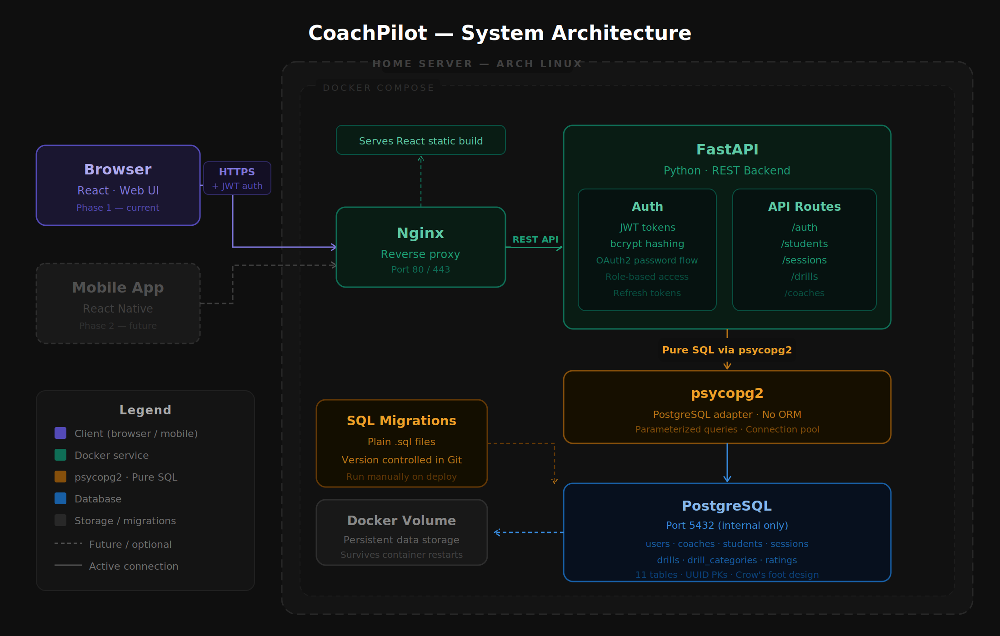

# Green Fuzzy Ball 🎾

A self-hosted tennis coaching management app for tracking students,
sessions, drills, and progress over time.

Built as a full-stack portfolio project with a focus on database
design, pure SQL, and self-hosted infrastructure.



---

## Features

- Manage a roster of students with profiles, levels, and age groups
- Build a personal drill library organized by categories
- Log coaching sessions (private or group) with attendance tracking
- Rate each student on each drill per session (1–10 scale)
- Track student progress over time with drill rating history
- Share drills and sessions with other coaches via export link
- Coach-only in Phase 1 — student login coming in Phase 2

---

## Tech Stack

| Layer | Technology |
|---|---|
| Frontend | React |
| Backend | FastAPI (Python) |
| Database | PostgreSQL |
| SQL Driver | psycopg2 (pure SQL, no ORM) |
| Reverse Proxy | Nginx |
| Containerization | Docker Compose |
| Server | Self-hosted · Arch Linux |

---

## Architecture

Green Fuzzy Ball runs entirely on a home server. All services are
containerized with Docker Compose — Nginx, FastAPI, and PostgreSQL
each run in their own container with a shared Docker volume for
persistent data.

→ [Full architecture documentation](docs/architecture.md)

---

## Database Design

The database is built around 11 tables with UUID primary keys,
composite primary keys on junction tables, and pure SQL queries
via psycopg2. No ORM.

→ [Full database documentation](docs/database-design.md)

---

## API

RESTful API built with FastAPI. JWT authentication with role-based
access control for coaches and students.

→ [Full API documentation](docs/api.md)

---

## Project Structure
GreenFuzzyBall/
├── README.md
├── docker-compose.yml
├── docs/
│   ├── architecture.md
│   ├── database-design.md
│   ├── api.md
│   └── images/
│       ├── GreenFuzzyBall-Architecture.png
│       └── GreenFuzzyBall-ERD.png
├── backend/
│   ├── Dockerfile
│   ├── requirements.txt
│   ├── main.py
│   ├── routes/
│   ├── db/
│   └── migrations/
└── frontend/
├── Dockerfile
└── src/

---

## Getting Started

### Prerequisites
- Docker and Docker Compose installed
- Git

### Run locally

```bash
# Clone the repo
git clone https://github.com/yourusername/greenfuzzyball.git
cd greenfuzzyball

# Copy environment variables
cp .env.example .env

# Start all services
docker compose up --build
```

The app will be available at `http://localhost`.

---

## Roadmap

- [x] Database design and schema
- [x] Architecture design
- [ ] FastAPI backend — auth and routes
- [ ] React frontend
- [ ] Deploy to home server
- [ ] Phase 2 — student login and progress view
- [ ] Phase 3 — mobile app (React Native)

---

## Documentation

| Doc | Description |
|---|---|
| [Architecture](docs/architecture.md) | System design, Docker setup, request flow |
| [Database Design](docs/database-design.md) | ER diagram, schema, design decisions |
| [API](docs/api.md) | All endpoints with request and response examples |

---

## Author

Built by [Agah Duzenli] · [LinkedIn] · [GitHub]